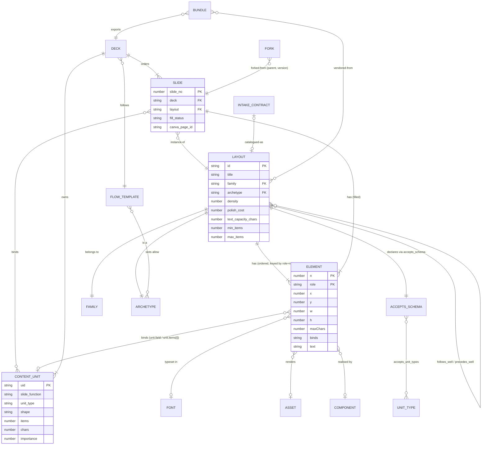

# `spec/ontology.md` — entities, relations, invariants

The human-readable ontology of the slide system: what the twelve entities are, what they carry, how they connect, and what must always be true. The machine-readable forms are `spec/schema/*.json` (key sets and types), `spec/vocab/*.json` (controlled values) and `spec/schema/layouts/<id>.json` (per-layout accepts). Key-by-key detail lives in `spec/schema.md`; this file is the model.

Grounding: element roles reconcile OOXML `ST_PlaceholderType` and Google Slides `PlaceholderType` (`research/06 §a`); content units carry three independent typed fields rather than one enum (`research/06 §b`); `accepts` copies Presenton's per-layout JSON Schema with `minItems`/`maxItems`, the only public system with formal per-layout constraints (`research/06 §c`); decomposition numbers come from DOC2PPT, Paper2Poster, PLOS and Kawasaki (`research/06 §d`); retrieval is shaped by Obsidian's six property types and Bases' YAML filters (`research/06 §e`). Vocabularies use SKOS's flat keys (`research/06 §f`). This is Decision 8.

---

## The model at a glance



---

## Entities

### Layout — the class

`layouts/L###-<archetype>.md`. Geometry, typography and capacity for one slide class. Never contains real content, only placeholders. Schema: `layout.schema.json`.

| Attribute | Type | Notes |
|---|---|---|
| `id` | text `L###` | Primary key; matches the filename. |
| `title` | text | Human name, e.g. "KPI Grid 2x3". Not an id: the machine-readable class is `archetype`. Used as the page label by `build-html` and as the Layout column in `bases/layouts.base`. |
| `family` `archetype` `variant` `flow_role` | vocab text | The retrieval axes. `family` must equal the archetype's `broader`. `archetype` is one of the 104 kebab-case ids that `spec/taxonomy.md` defines and `spec/vocab/archetype.json` mirrors; `flow_role` (`opener \| bridge \| body \| evidence \| closer`) is the layout's narrative position, distinct from a unit's `slide_function`. |
| `content_shape[]` | vocab list | Modalities the layout can host (`research/06 §b` Layer 3). |
| `density` `polish_cost` | number 1–5 | Rubric levels (`research/03 §c`, `§d`). |
| `info_units` `min_items` `max_items` | number | Capacity. At most 6 elements on a slide (`research/06 §d`, PLOS rule 7). |
| `text_capacity_chars` | number | Derived; see invariant 1. |
| `slots_image` `slots_chart` `slots_table` | number | Counts of visual roles, used by the planner's shape filter. |
| `fonts[]` `fonts_native` `pairing` `brand` | list / checkbox / text | Typography and brand. Registry, not allowlist (Decision 5). |
| `follows_well[]` `precedes_well[]` | list | Continuity hints scored by `match.mjs`. |
| `tags[]` `status` `origin` | list / vocab text / path | Retrieval and lifecycle. |
| `accepts_schema` `canva_ops` | path | Pointers to the JSON side of the layout. |
| `family_deck` `family_page` `canva_locators[]` | quoted ids | Where this layout lives in Canva and how to address its elements. |

### Element — a row of a layout or slide table

Not a file. Keyed by `(role, n)`, exactly as OOXML and Google Slides key a placeholder (`research/06 §a`). Columns: `n, role, x, y, w, h, font, weight, size, lh, align, maxChars, binds, text`, all in px on a 1920×1080 page. Roles come from `element_role.json`, whose five grouping concepts classify them: `text_role` (contributes to `text_capacity_chars`), `visual_role`, `decor_role`, `chrome_role` (excluded from planning per `research/06 §a`), `offstage_role` (speaker notes). Visual and decor rows carry a **spec string** in `text` instead of copy.

### ContentUnit — the atom the planner places

One `## u###` section in `presentations/<slug>/units.md`. Carries **three independent typed fields**, not one enum (`research/06 §b`): `slide_function` (Layer 1: opening, agenda, section, content, summary, closing, appendix), `unit_type` (Layer 2: 18 rhetorical types from Stab & Gurevych, RST, Minto SCQA, DOC2PPT) and `shape` (Layer 3: text, bullets, number, image, chart, table, diagram, quote). Plus `items`, `chars`, `has_number`, `evidence_kind`, `importance`, `must_include`, `source`, `section`.

### Slide — the instance

`presentations/<slug>/slides/S##-<archetype>.md`. A layout id, the units bound into it, the same element table with real copy, speaker notes, and Canva state (`canva_page_id`, `locators[]`). `fill_status` is `auto → edited → approved`.

### Fork — a redline candidate

The same file type with `parent` set and `version > 1`, written `S##-<archetype>.v<n>.md` by Skill 3. Carries `change_request` **verbatim** and `changed_keys[]`, which must exactly explain the before/after pixel diff. Promotion sets `fill_status: approved` and archives the parent. A Fork is not a separate schema — it is a Slide in a lineage.

### Deck — the presentation project

`presentations/<slug>/` with `brief.md` (the dials), `context/`, `units.md`, `plan.md`, `slides/`, `build/`, `canva.md`. Two frontmatter blocks are schema-checked: the brief (audience, purpose, delivery_mode, length/target, density, polish, verbosity, content_generation, pairing, brand, brand_kit_id, fonts_native_required, content_public) and the plan (flow_template, target_slides, density, polish, layout_sequence, route, unplaced_units, overflow_count).

### FlowTemplate — an ordered sequence of slots

`spec/flows.md` plus `spec/vocab/flow_template.json`, which share the ten ids `scqa_pyramid`, `sequoia_pitch`, `kawasaki_10_20_30`, `slidebean_3act`, `duarte_sparkline`, `gagne_teaching`, `status_update`, `workshop`, `slidedoc`, `takahashi_lessig`. Ten named sequences with target lengths and per-slot archetypes (`research/03 §b`): SCQA/pyramid consulting deck, Sequoia pitch, Kawasaki 10/20/30, Slidebean three-act, Duarte sparkline, Gagné teaching module, status update, workshop, executive-summary-first slidedoc, Takahashi/Lessig rapid talk. Each of the 13 `purpose` values maps to a default template, declared in that purpose's `examples` and repeated as a row of `spec/flows.md` § "Purpose to flow mapping"; each template's `examples` carry its length and slot order.

### Font — a registry entry

`spec/fonts.json`. `family, weights_used, category, source, license, canva_native, canva_fallback, fallback_weight_map, optical_size_note`. A registry, not an allowlist (Decision 5): unregistered families are errors, non-native families are warnings. Wrap widths are computed against **Inter** metrics whatever the family, so a Söhne or GT America layout re-renders in Inter with ≤ 1 line of drift.

### Asset — a placeholder or real image

`manifest/assets.json` over files in `assets/`. `id, path, kind, w, h, alt, source, license, canva_asset_id, used_by[]`. Layouts reference only placeholders; slides may bind real assets. Public-repo assets must be redistributable (Decision 4).

### Component — a branded custom element

`components/slides/<Name>/` as a React package emitting the four-file Design Sync card (`<Name>.html`, `.jsx`, `.prompt.md`, `.d.ts`), registered in `manifest/components.json` and pushed into the "alderman.ai Design System" project (Decision 9). An Element may be **realised by** a Component: the table row keeps its geometry and gains a `component: <Name>` note in `text`. Components have no frontmatter schema; the manifest is their record.

### IntakeContract — the operator surface for Skill 4

`intake/<yyyymmdd>-<slug>.md`. Frontmatter is the contract: what was detected, from what, at what confidence, with what open questions. The body is the extracted element table plus a per-row `confidence` column. Nothing converts until the operator sets `status: confirmed`.

### Bundle — a portable, self-contained deck

`bundles/<slug>/`. Frontmatter contract (`bundle_id, title, created, library_version, layout_ids[], slide_count, fonts[], fonts_native, routes_supported[], brand, pairing, content_public, license`) plus vendored copies of the layouts used, built HTML and ops, assets, checksums, and a pinned copy of the upload skill and scripts. A bundle must reference nothing outside itself (Decision 11). Canva state is per account in `canva/<account-id>.md` and git-ignored.

---

## Relations and cardinalities

| Relation | From → To | Cardinality | Where it lives | Meaning |
|---|---|---|---|---|
| **has** | Layout → Element | 1 → 1..N | `## Elements` table | Ordered rows; order is z-order and locator order. |
| **accepts** | Layout → ContentUnit type | 1 → 1..N types, each with `min`/`max` | `accepts_schema` (`spec/schema/layouts/<id>.json`) | Which unit types the layout takes and in what quantity. Presenton's shape (`research/06 §c`). `match.mjs` validates a binding against it **before** scoring. |
| **binds** | Element → ContentUnit field | 0..1 → 1 field | `binds` column | `unit.<field>`, `unit.items[i]` (1-based), or `<uid>.<field>`. `-` when the layout fills the element itself. |
| **binds** | Slide → ContentUnit | 1 → 0..N | `units[]` | Which units this slide carries; the first is the primary unit for bare `unit.*` bindings. |
| **instance-of** | Slide → Layout | N → 1 | `layout` | A slide is one instantiation of a layout class. Element rows must match the layout's rows in `(role, n)` and geometry unless a fork changed them. |
| **follows_well / precedes_well** | Layout → Layout | N ↔ N | `follows_well[]`, `precedes_well[]` | Adjacency preference, scored as continuity by `match.mjs`. Non-transitive, not required to be symmetric. |
| **forked-from** | Fork → Slide | N → 1 | `parent`, `version` | A redline candidate. Exactly one parent; a parent may have many forks. |
| **is a / belongs to** | Layout → Archetype → Family | N → 1 → 1 | `archetype`, `family` | `broader` in `archetype.json` is the family. Two levels only. |
| **follows** | Deck → FlowTemplate | N → 1 | `flow_template` | One template per deck; `auto` resolves from `purpose`. |
| **slots allow** | FlowTemplate → Archetype | 1 → N per slot | `spec/flows.md` | Each ordered slot names the archetypes it will accept. |
| **catalogued-as** | IntakeContract → Layout | 1 → 0..1 | `layout_id` | An intake becomes at most one layout, at `status: catalogued`. |
| **vendored-from** | Bundle → Layout | N → N | `layout_ids[]` | The bundle holds **copies**, pinned at `library_version`; the originals stay in `layouts/`. `import-bundle` merges back, de-duplicating by `layout_id` and sha256. |
| **exports** | Bundle → Deck | 1 → 1 | `bundle_id` | One bundle per exported deck. |
| **typeset in** | Element → Font | N → 0..1 | `font` column | `-` for non-text rows. |
| **renders** | Element → Asset | N → 0..1 | spec string in `text` | Visual rows name a placeholder or asset id. |
| **realised by** | Element → Component | N → 0..1 | `manifest/components.json` | A branded custom element occupying the row's box. |

---

## Invariants

Full enforcement detail is in `spec/schema.md §Invariants`. The load-bearing ones:

1. **`text_capacity_chars` = Σ `maxChars`** over every element whose role has `broader: text_role`. Visual, decor, chrome and offstage roles carry `-` and contribute nothing. A mismatch is an error, not a warning.
2. **Every schema key is present on every file of that schema** (Decision 2). Empties are written `-`, `[]`, `0`, `false` — never omitted — so Bases columns and PowerShell filters are total.
3. **Vocabulary closure**: every vocab-typed value exists in its `spec/vocab/*.json` file, and every `enum` in `spec/schema/*.json` equals that file's value list.
4. **Family agreement**: `family` = `broader` of `archetype`.
5. **Accepts agreement**: `min_items`/`max_items` = `items.min`/`items.max`; every `requires` and `optional` role appears in the element table; `chars.<role>.max` = that role's `maxChars`.
6. **Geometry closure** on the 1920×1080 page; `n` contiguous from 1.
7. **Bindings resolve** to a field or item index that exists on a unit in `units[]`.
8. **No overflow ships**: any element whose `text` exceeds `maxChars` sets `overflow: true`, and an overflowing slide cannot be uploaded. Overflow triggers a **split** before density is raised (`research/03 §c`).
9. **Polish cap**: planned `polish_cost` ≤ the deck's dial (quick 2, standard 3, premium 5).
10. **Public hygiene**: no vendor design files anywhere (Decision 1); a bundle publishes only on explicit `content_public: true` (Decision 4).

### Planner rules that follow from the numbers

Sourced in `research/06 §d` and `research/03 §c`; the arithmetic lives in `spec/rubrics.md`.

- Slide budget: ~1 slide/min for talks, ~2 min/slide for business decks; read-decks are governed by page count, not pace.
- ~2.4 slides per source section, and slide sentences run ~0.67 the length of source sentences (DOC2PPT corpus).
- Insert a `section` slide at each top-level heading that yields ≥ 2 content slides, when the deck has ≥ 3 sections; insert `agenda` when there are ≥ 4 sections.
- Merge slides overlapping ≥ 80% with their predecessor (DOC2PPT treats them as animation builds).
- One idea per slide; at most 6 elements; the title states the takeaway as a full sentence.

---

## How retrieval works

Three surfaces read the same frontmatter. Nothing is indexed twice by hand: `manifest/layouts.json` is a derived cache, rebuilt by `index.mjs`.

### Obsidian Bases

`bases/*.base` files are plain YAML with `filters` (recursive `and`/`or`/`not`), `formulas`, `properties`, `summaries` and a `views` array (`type`, `name`, `limit`, `groupBy`, `order`, per-view `filters`), over the namespaces `note.*`, `file.*`, `formula.*` (`research/06 §e`). Because a `.base` is plain YAML, the same filter can be re-evaluated from PowerShell.

Obsidian has exactly **six property types** — Text, List, Number, Checkbox, Date, Date & time — assigned **per property name vault-wide**, and **no enum type** (`research/06 §e`). Two consequences the whole design turns on:

- Vocabulary is enforced **externally**, by `validate`, never by the editor.
- Single-valued vocab fields are Text, multi-valued are List, and every Bases filter wraps with **`list()`** — "if the provided element is a list, returns it unmodified, otherwise wraps" — so a layout with one `content_shape` and one with four filter identically:

```yaml
filters:
  and:
    - 'list(note.content_shape).containsAny(list("bullets", "text"))'
    - 'note.polish_cost <= 3'
    - 'note.status != "draft"'
```

Useful functions for this vault: `contains` / `containsAny` / `containsAll`, `list.filter/map/unique/flat/join`, `if()`, `isEmpty()`, `file.hasTag/hasProperty/inFolder`. Summaries give Unique and Filled counts, which is how the library's coverage-by-archetype view is built. Embed a view in a note with `![[Layouts.base#By family]]`.

Planned bases: `layouts` (by family, archetype, polish_cost, density), `units` (by unit_type and importance, per deck), `decks` (status roll-up) and `redlines` (open threads).

### PowerShell — `scripts/slides.ps1`

`Install-Module powershell-yaml`; `ConvertFrom-Yaml -Ordered` returns an OrderedDictionary. Two traps, both from `research/06 §e`:

- `ConvertFrom-Markdown` does **not** expose frontmatter (PowerShell issue #16857), so `slides.ps1` splits on the first two `---` lines itself before parsing.
- Bare numbers become `Int64`, so every id is written as a **quoted string** in frontmatter.

The retrieval pattern mirrors the Bases `list()` wrap with `@()`:

```powershell
Get-ChildItem -Recurse layouts\*.md |
  ForEach-Object { Split-Frontmatter $_ | ConvertFrom-Yaml -Ordered } |
  Where-Object { @($_.content_shape) -contains 'bullets' -and $_.polish_cost -le 3 }
```

`slides.ps1 find -Shape … -Items … -MaxPolish … -Component …` is exactly this filter with named parameters; `show <layout-id>` prints one layout's frontmatter, element table and accepts.

### Scripts — the planner path

`match.mjs` scores a unit against a layout in this order: (1) validate the binding against the layout's `accepts_schema` — a hard gate, not a score (`research/06 §c`); (2) `shape` ∈ `content_shape[]`; (3) item count inside `min_items…max_items`; (4) `chars` against `text_capacity_chars`; (5) `polish_cost` within the deck dial; (6) `fonts_native` when the brief requires it; (7) `follows_well` continuity with the previous slide; (8) a variety penalty for repeating a layout. `plan.mjs` picks the flow template from `purpose`, computes the slide budget from `length_minutes`/`target_slides`/`density`, merges and splits units to fit, and writes `plan.md` with the fit report. `index.mjs` maintains `manifest/layouts.json` and writes Canva ids and locators back into the layout and slide files.
